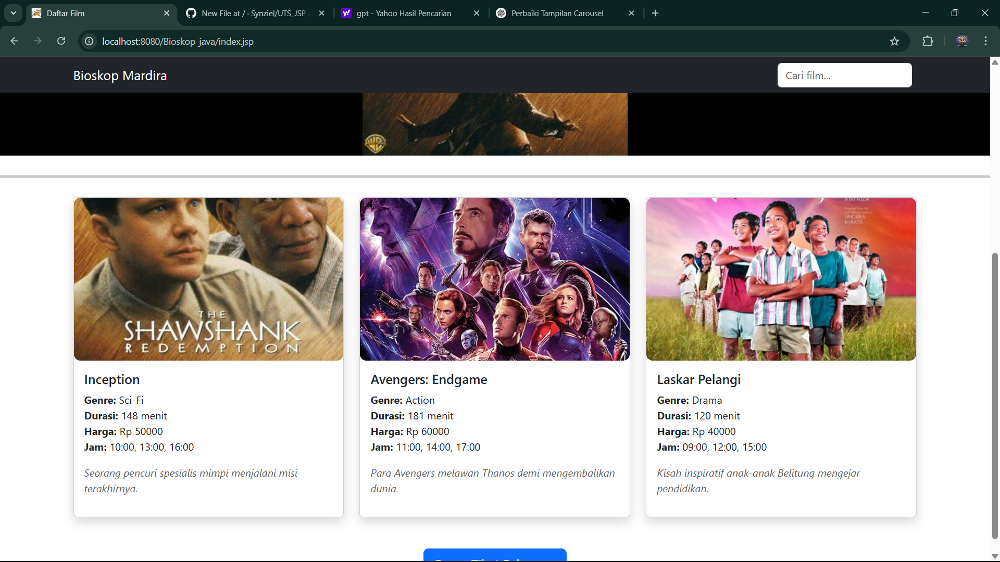
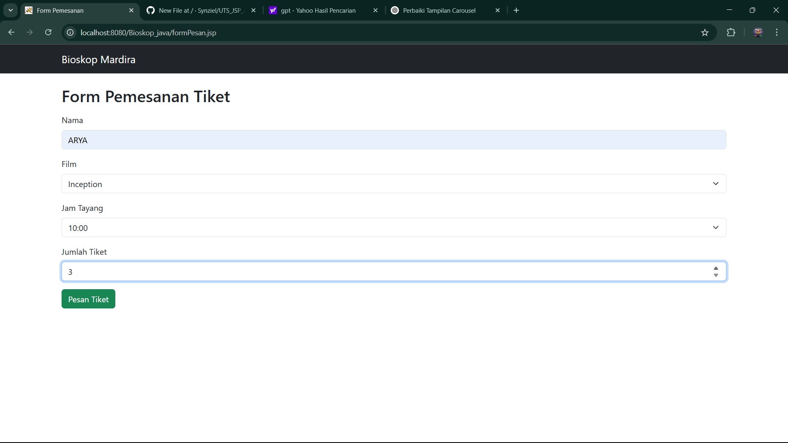
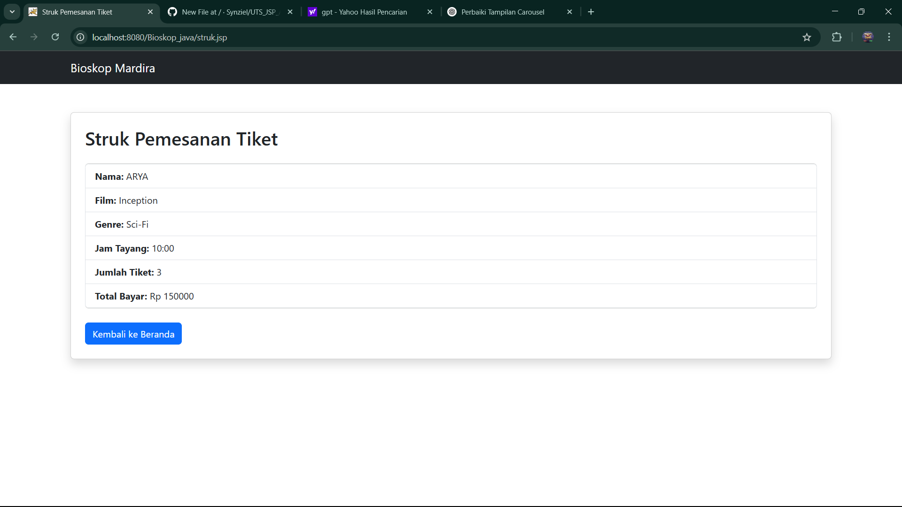

# 🎬 UTS_JSP_12345678_ARYA DUTHA RAMADHAN

## 📌 Deskripsi Project
Project ini merupakan aplikasi pemesanan tiket bioskop berbasis JSP (Java Server Pages). Pengguna dapat melihat daftar film, memilih film beserta jam tayangnya, dan memesan tiket melalui form JSP. Transaksi akhir akan menampilkan ringkasan pemesanan.

## ✅ Fitur
- Menampilkan daftar film dari `ArrayList`
- Carousel gambar film
- Form pemesanan tiket berbasis JSP
- Menampilkan hasil transaksi akhir (nama, film, jam tayang, jumlah tiket, total harga)
- Filter pencarian film secara langsung

## 🖼️ Screenshot Hasil Output
### Halaman Daftar Film


### Halaman Form Pemesanan


### Hasil Transaksi



## ▶️ Cara Menjalankan Aplikasi
1. Clone repository ini:
   ```bash
   git clone https://github.com/username/UTS_JSP_ARYA-DUTHA-RAMADHAN_22110456
